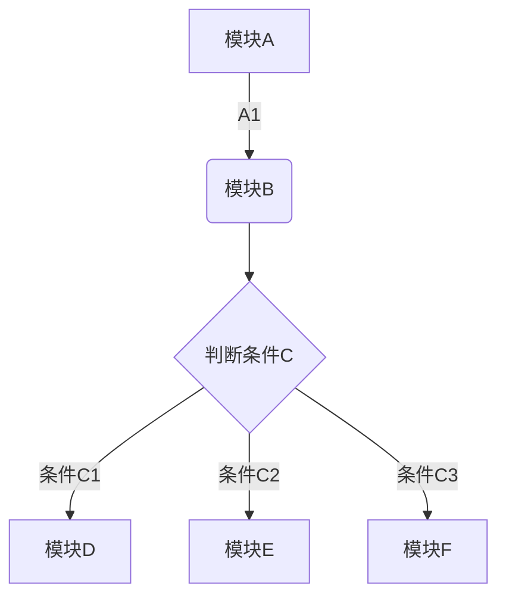
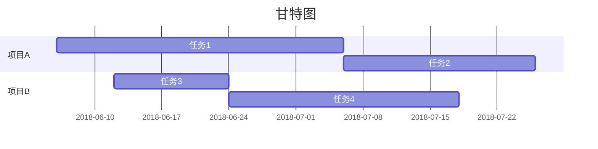

# GITHUB 测试
## GITHUB 测试标题2
### GITHUB 测试标题3
<u>测试下划线</u>
**测试粗体**
~~测试删除线~~

* * *
>测试引用

* 测试列表
* 1
* 2
* 3
*

```mermaid
graph TD
A[模块A] -->|A1| B(模块B)
B --> C{判断条件C}
C -->|条件C1| D[模块D]
C -->|条件C2| E[模块E]
C -->|条件C3| F[模块F]
```

```mermaid
gantt
title 甘特图
dateFormat  YYYY-MM-DD
section 项目A
任务1           :a1, 2018-06-06, 30d
任务2     :after a1  , 20d
section 项目B
任务3      :2018-06-12  , 12d
任务4      : 24d
```
